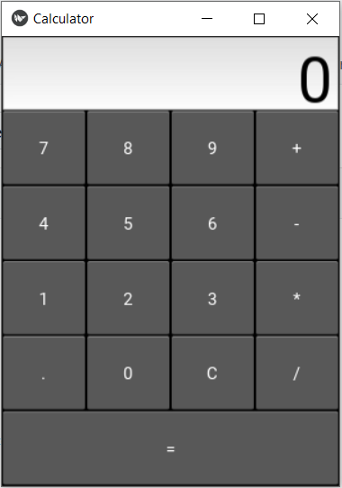

# Yet Another Calculator

A sample GUI based on the Kivy library that represents a basic calculator application. 

The calculator allows for simple operations: 
- [+]
- [-]
- [*]
- [/]

A solution is received by using the '=' button. 

